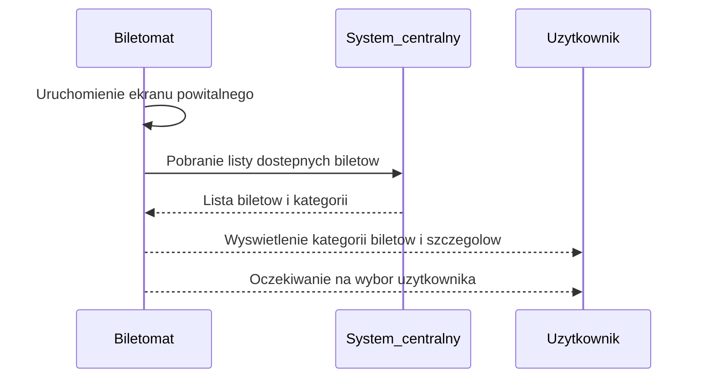

# Aktor: Biletomat

## DIAGRAMY PRZYPADKÓW UŻYCIA

### WYŚWIETLENIE DOSTĘPNYCH BILETÓW

```mermaid
flowchart TD
    Start([Inicjalizacja biletomatu]) --> A[Uruchomienie ekranu powitalnego]
    A --> B[Pobranie listy biletów]
    B --> C[Wyświetlenie biletów]
    C --> D[Oczekiwanie na wybór użytkownika]
    D --> End([Rejestracja wyboru użytkownika])
    
    %% Include relations - Aktualizacja biletów
    A --> E[Aktualizacja biletów]
    E --> B
    
    %% Extend relations - Ostrzeżenie o braku danych
    B --> F[Ostrzeżenie o braku danych]
    F -.->|awaria sieci| G[Wyświetlenie komunikatu błędu]
    G --> H[Użycie lokalnej kopii danych]
    H --> C
    
    style Start fill:#e1f5fe
    style End fill:#f3e5f5
    style E fill:#fff3e0
    style F fill:#ffebee
    style G fill:#ffebee
    style H fill:#f1f8e9
```

### OBSŁUGA WYBORU JĘZYKA

```mermaid
flowchart TD
    Start([Inicjalizacja interfejsu językowego]) --> A[Wyświetlenie opcji językowych]
    A --> B[Rejestracja wyboru języka]
    B --> C[Dostosowanie interfejsu]
    C --> End([Interfejs w wybranym języku])
    
    %% Include relations - Opcje językowe
    Start --> D[Opcje językowe]
    D --> A
    
    %% Extend relations - Powrót do języka domyślnego
    A --> E[Powrót do języka domyślnego]
    E -.->|po braku aktywności użytkownika| F[Reset do języka domyślnego]
    F --> A
    
    style Start fill:#e1f5fe
    style End fill:#f3e5f5
    style D fill:#fff3e0
    style E fill:#f1f8e9
    style F fill:#ffebee
```

## DIAGRAMY SEKWENCJI
### SZYBKI WYBÓR RODZAJU BILETU

```mermaid
sequenceDiagram
    participant B as Biletomat
    participant SC as System_centralny
    participant U as Uzytkownik

    B->>B: Uruchomienie ekranu powitalnego
    B->>SC: Pobranie listy dostepnych biletow
    SC-->>B: Lista biletow i kategorii

    B-->>U: Wyswietlenie kategorii biletow i szczegolow
    B-->>U: Oczekiwanie na wybor uzytkownika
```
