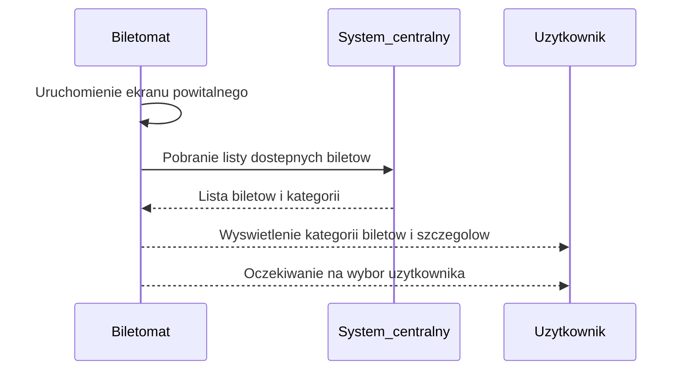
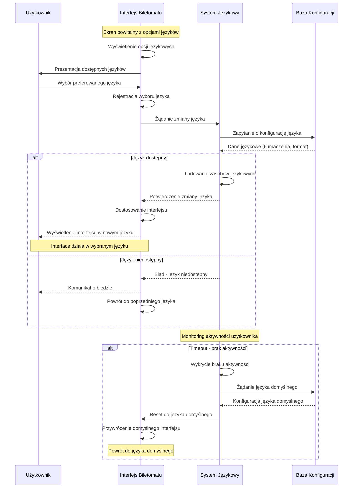
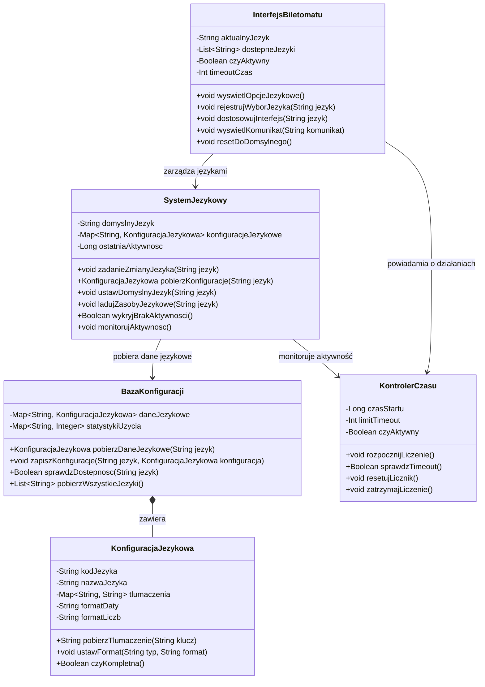

# Aktor: Biletomat

## DIAGRAMY PRZYPADKÓW UŻYCIA

### WYŚWIETLENIE DOSTĘPNYCH BILETÓW

### OBSŁUGA WYBORU JĘZYKA

## DIAGRAMY SEKWENCJI
### SZYBKI WYBÓR RODZAJU BILETU 

### DIAGRAM SEKWENCJI DLA PRZYPADKU UŻYCIA "OBSŁUGA WYBORU JĘZYKA"

**AKTOR:** BILETOMAT  
**OBIEKTY:** INTERFEJS BILETOMATU, SYSTEM JĘZYKOWY, BAZA KONFIGURACJI, UŻYTKOWNIK

### DIAGRAMY KLAS

#### ANALIZA PRZYPADKU UŻYCIA I DIAGRAMU SEKWENCJI - OBSŁUGA WYBORU JĘZYKA

Na podstawie diagramu sekwencji dla przypadku użycia "Obsługa wyboru języka" zidentyfikowano następujące klasy odpowiedzialne za realizację funkcjonalności:

## OPIS KLAS

### ZIDENTYFIKOWANE KLASY:

- **INTERFEJSBILETOMATU** - odpowiada za wyświetlanie opcji językowych i interakcję z użytkownikiem
- **SYSTEMJEKOWY** - zarządza zmianami języka i monitoruje aktywność użytkownika  
- **BAZAKONFIGURACJI** - przechowuje dane językowe i konfiguracje
- **KONFIGURACYJEKOWA** - reprezentuje ustawienia pojedynczego języka
- **KONTROLERCZASU** - monitoruje timeout i powrót do języka domyślnego

