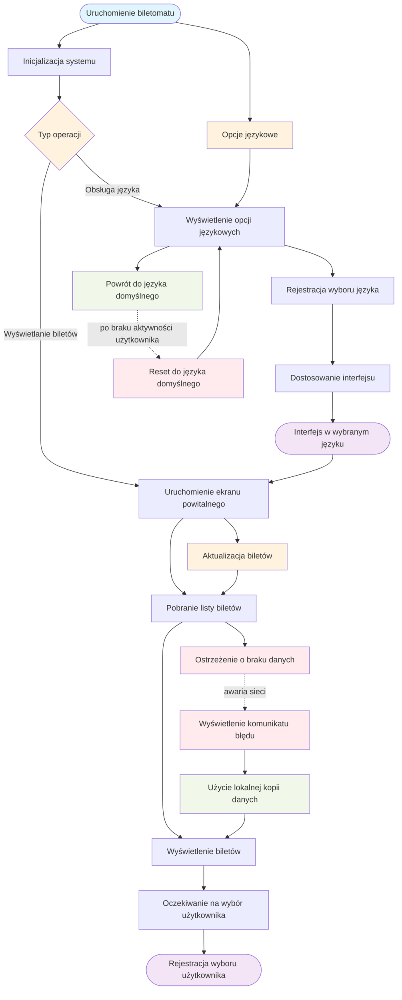

# Aktor: Biletomat

## Historyjki użytkownika

### Historia 1
Jako biletomat, chcę posiadać czytelny ekran dotykowy, aby użytkownik mógł łatwo nawigować po interfejsie.

### Historia 2
Jako biletomat, chcę być wyposażony w różne metody płatności (terminal kart, czytnik gotówki, NFC), aby obsługiwać różnorodne transakcje.

### Historia 3
Jako biletomat, chcę wydawać resztę w gotówce, jeśli użytkownik zapłaci nadmiarowo, aby transakcja była zgodna z oczekiwaniami.

## DIAGRAMY PRZYPADKÓW UŻYCIA

### WYŚWIETLENIE DOSTĘPNYCH BILETÓW

### OBSŁUGA WYBORU JĘZYKA

## Wspólny diagram przypadków użycia

### DIAGRAM PRZYPADKÓW UŻYCIA - BILETOMAT

