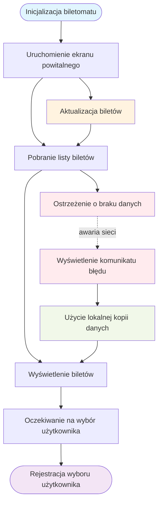
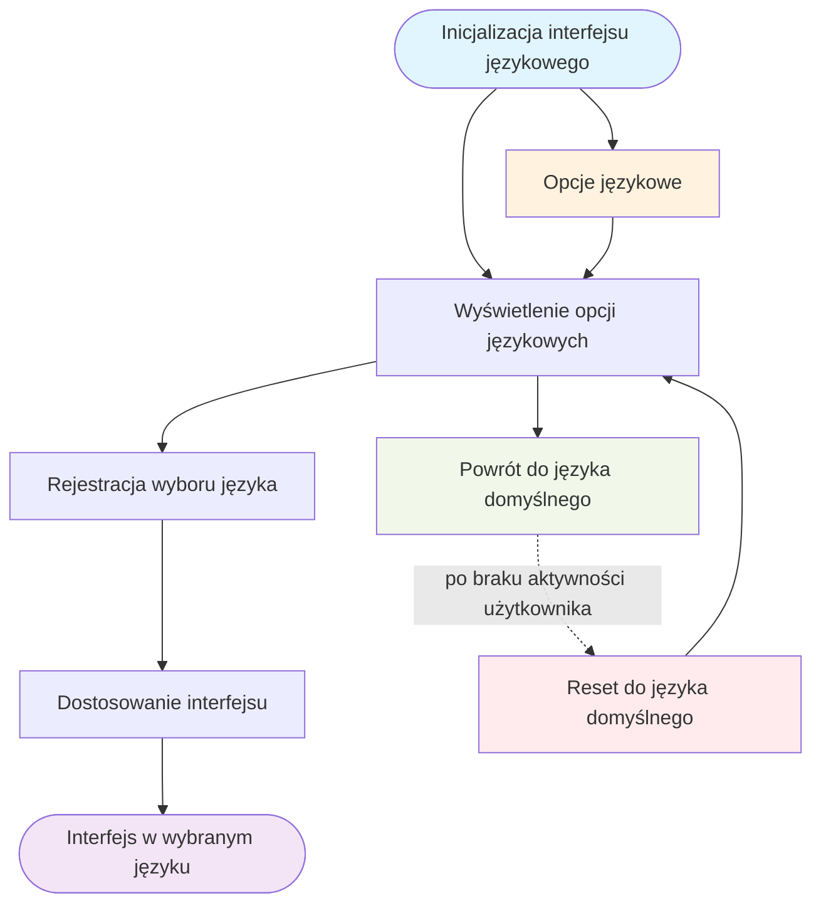

# Aktor: Biletomat

## DIAGRAMY PRZYPADKÓW UŻYCIA

### WYŚWIETLENIE DOSTĘPNYCH BILETÓW



### OBSŁUGA WYBORU JĘZYKA



## DIAGRAMY SEKWENCJI
### SZYBKI WYBÓR RODZAJU BILETU 
```mermaid
sequenceDiagram
    participant B as Biletomat
    participant SC as System_centralny
    participant U as Uzytkownik

    B->>B: Uruchomienie ekranu powitalnego
    B->>SC: Pobranie listy dostepnych biletow
    SC-->>B: Lista biletow i kategorii

    B-->>U: Wyswietlenie kategorii biletow i szczegolow
    B-->>U: Oczekiwanie na wybor uzytkownika

### DIAGRAM SEKWENCJI DLA PRZYPADKU UŻYCIA "OBSŁUGA WYBORU JĘZYKA"

**AKTOR:** BILETOMAT  
**OBIEKTY:** INTERFEJS BILETOMATU, SYSTEM JĘZYKOWY, BAZA KONFIGURACJI, UŻYTKOWNIK

```mermaid
sequenceDiagram
    participant U as Użytkownik
    participant IB as Interfejs Biletomatu
    participant SJ as System Językowy
    participant BK as Baza Konfiguracji
    
    Note over IB: Ekran powitalny z opcjami języków
    IB->>IB: Wyświetlenie opcji językowych
    IB->>U: Prezentacja dostępnych języków
    
    U->>IB: Wybór preferowanego języka
    IB->>IB: Rejestracja wyboru języka
    
    IB->>SJ: Żądanie zmiany języka
    SJ->>BK: Zapytanie o konfigurację języka
    BK-->>SJ: Dane językowe (tłumaczenia, format)
    
    alt Język dostępny
        SJ->>SJ: Ładowanie zasobów językowych
        SJ-->>IB: Potwierdzenie zmiany języka
        IB->>IB: Dostosowanie interfejsu
        IB-->>U: Wyświetlenie interfejsu w nowym języku
        Note over U, IB: Interface działa w wybranym języku
    else Język niedostępny  
        SJ-->>IB: Błąd - język niedostępny
        IB-->>U: Komunikat o błędzie
        IB->>IB: Powrót do poprzedniego języka
    end
    
    Note over SJ: Monitoring aktywności użytkownika
    
    alt Timeout - brak aktywności
        SJ->>SJ: Wykrycie braku aktywności
        SJ->>BK: Żądanie języka domyślnego
        BK-->>SJ: Konfiguracja języka domyślnego
        SJ->>IB: Reset do języka domyślnego  
        IB->>IB: Przywrócenie domyślnego interfejsu
        Note over IB: Powrót do języka domyślnego
    end
```
