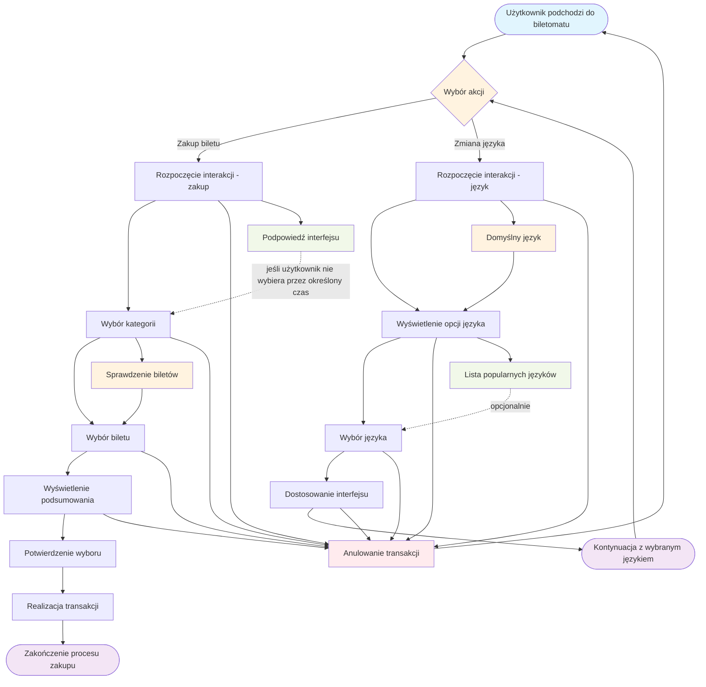

# Aktor: Użytkownik

## Historyjki użytkownika

### Historia 1
Jako użytkownik, chcę płacić za bilet kartą, gotówką lub telefonem, aby mieć większą elastyczność w wyborze metody płatności.

### Historia 2
Jako użytkownik, chcę otrzymać wyraźne instrukcje na ekranie, aby wiedzieć, jak dokonać zakupu krok po kroku.

### Historia 3
Jako użytkownik, chcę widzieć czas pozostały na decyzję (np. wyświetlany licznik czasu), aby móc szybko podjąć działanie.

## DIAGRAMY PRZYPADKÓW UŻYCIA

### SZYBKI WYBÓR RODZAJU BILETU

### WYBÓR JĘZYKA

## Wspólny diagram przypadków użycia

### DIAGRAM PRZYPADKÓW UŻYCIA - UŻYTKOWNIK

