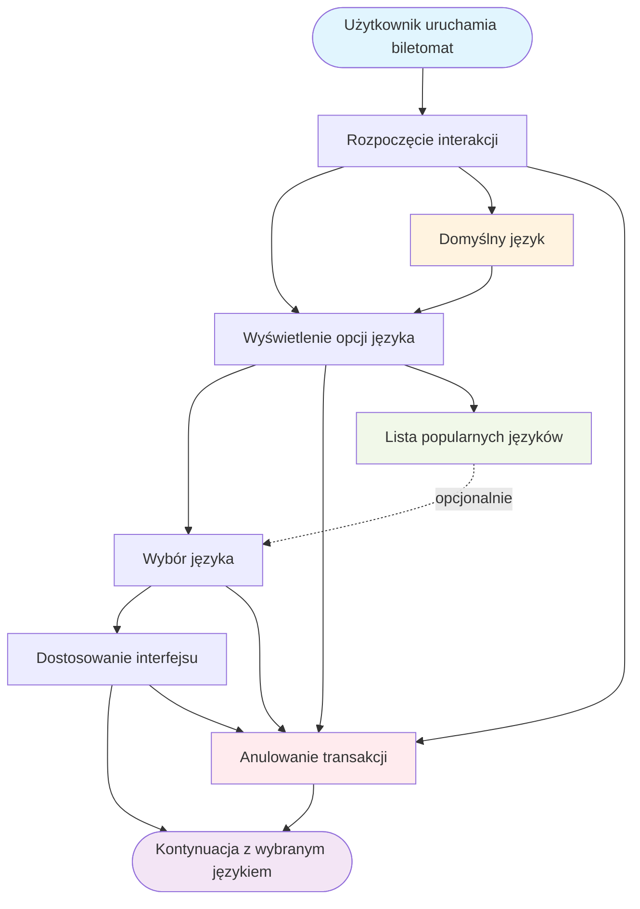
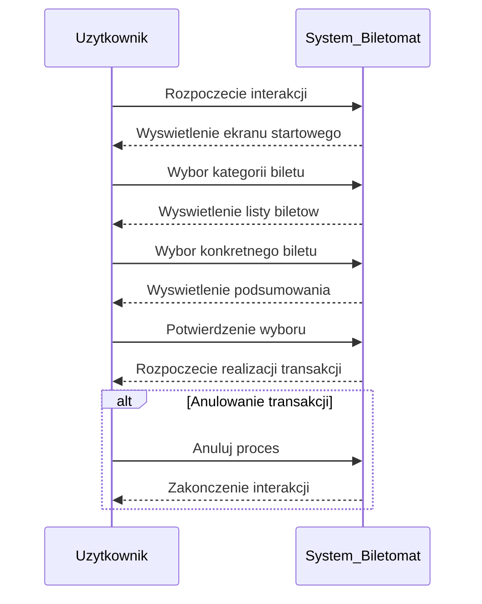

# Aktor: Użytkownik

## DIAGRAMY PRZYPADKÓW UŻYCIA

### SZYBKI WYBÓR RODZAJU BILETU

```mermaid
flowchart TD
    Start([Użytkownik podchodzi do biletomatu]) --> A[Rozpoczęcie interakcji]
    A --> B[Wybór kategorii]
    B --> C[Wybór biletu]
    C --> D[Wyświetlenie podsumowania]
    D --> E[Potwierdzenie wyboru]
    E --> F[Realizacja transakcji]
    F --> End([Zakończenie procesu])
    
    %% Include relations - Sprawdzenie biletów
    B --> G[Sprawdzenie biletów]
    G --> C
    
    %% Include relations - Anulowanie transakcji (dostępne w dowolnym momencie)
    A --> H[Anulowanie transakcji]
    B --> H
    C --> H
    D --> H
    E --> H
    H --> End
    
    %% Extend relations - Podpowiedź interfejsu
    A --> I[Podpowiedź interfejsu]
    I -.->|jeśli użytkownik nie wybiera przez określony czas| B
    
    style Start fill:#e1f5fe
    style End fill:#f3e5f5
    style G fill:#fff3e0
    style H fill:#ffebee
    style I fill:#f1f8e9
```

### WYBÓR JĘZYKA

```mermaid
flowchart TD
    Start([Użytkownik uruchamia biletomat]) --> A[Rozpoczęcie interakcji]
    A --> B[Wyświetlenie opcji języka]
    B --> C[Wybór języka]
    C --> D[Dostosowanie interfejsu]
    D --> End([Kontynuacja z wybranym językiem])
    
    %% Include relations - Domyślny język
    A --> E[Domyślny język]
    E --> B
    
    %% Include relations - Anulowanie transakcji (dostępne w dowolnym momencie)
    A --> F[Anulowanie transakcji]
    B --> F
    C --> F
    D --> F
    F --> End
    
    %% Extend relations - Lista popularnych języków
    B --> G[Lista popularnych języków]
    G -.->|opcjonalnie| C
    
    style Start fill:#e1f5fe
    style End fill:#f3e5f5
    style E fill:#fff3e0
    style F fill:#ffebee
    style G fill:#f1f8e9
```

## DIAGRAMY SEKWENCJI

### SZYBKI WYBÓR RODZAJU BILETU

```mermaid
sequenceDiagram
    participant U as Uzytkownik
    participant S as System_Biletomat

    U->>S: Rozpoczecie interakcji
    S-->>U: Wyswietlenie ekranu startowego

    U->>S: Wybor kategorii biletu
    S-->>U: Wyswietlenie listy biletow

    U->>S: Wybor konkretnego biletu
    S-->>U: Wyswietlenie podsumowania

    U->>S: Potwierdzenie wyboru
    S-->>U: Rozpoczecie realizacji transakcji

    alt Anulowanie transakcji
        U->>S: Anuluj proces
        S-->>U: Zakonczenie interakcji
    end

```
