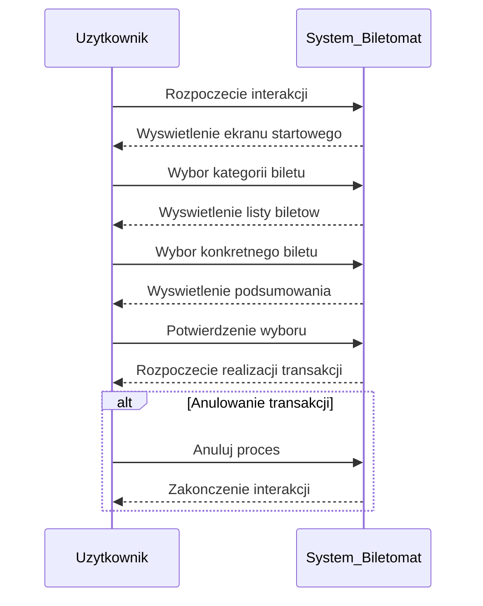
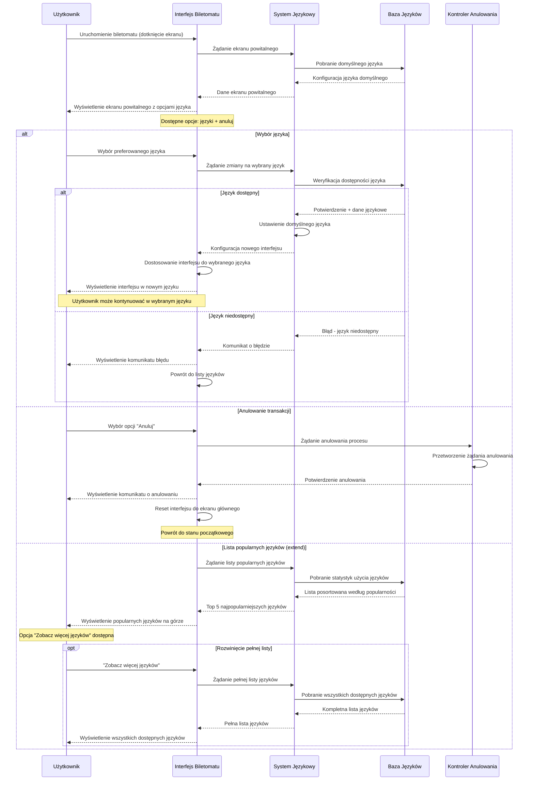
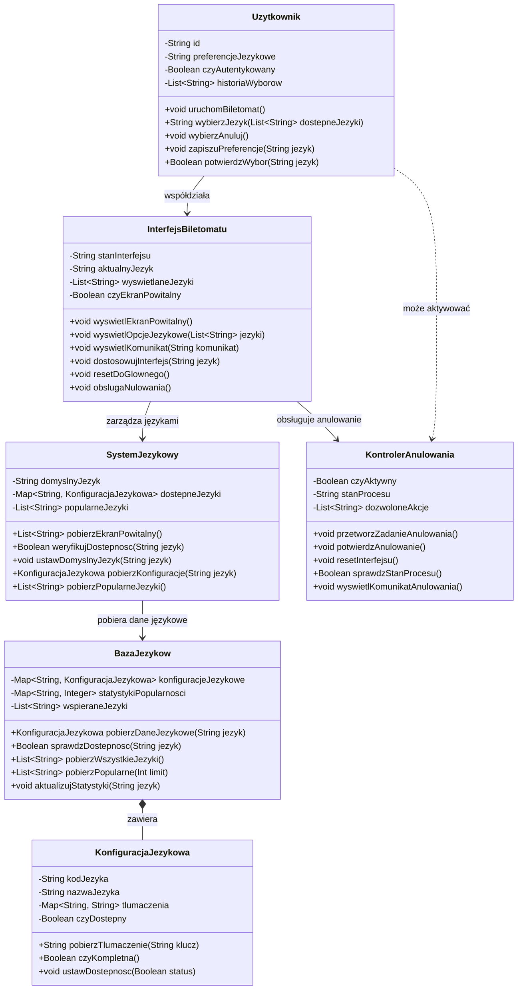

# Aktor: Użytkownik

## DIAGRAMY PRZYPADKÓW UŻYCIA

### SZYBKI WYBÓR RODZAJU BILETU

### WYBÓR JĘZYKA

## DIAGRAMY SEKWENCJI

### SZYBKI WYBÓR RODZAJU BILETU

### DIAGRAM SEKWENCJI DLA PRZYPADKU UŻYCIA "WYBÓR JĘZYKA"

**AKTOR:** UŻYTKOWNIK  
**OBIEKTY:** INTERFEJS BILETOMATU, SYSTEM JĘZYKOWY, BAZA JĘZYKÓW, KONTROLER ANULOWANIA

### DIAGRAMY KLAS
Na podstawie diagramu sekwencji dla przypadku użycia "Wybór języka" zidentyfikowano następujące klasy odpowiedzialne za realizację funkcjonalności:

### ZIDENTYFIKOWANE KLASY:

- **UZYTKOWNIK** - reprezentuje osobę korzystającą z biletomatu i jej preferencje językowe
- **INTERFEJSBILETOMATU** - obsługuje wyświetlanie ekranu powitalnego i opcji językowych
- **SYSTEMJEKOWY** - zarządza dostępnymi językami i ich konfiguracjami
- **BAZAJEZYKOW** - przechowuje wszystkie dane językowe i statystyki popularności
- **KONTROLERANULOWANIA** - obsługuje proces anulowania transakcji
- **KONFIGURACYJEKOWA** - zawiera ustawienia i tłumaczenia dla konkretnego języka

